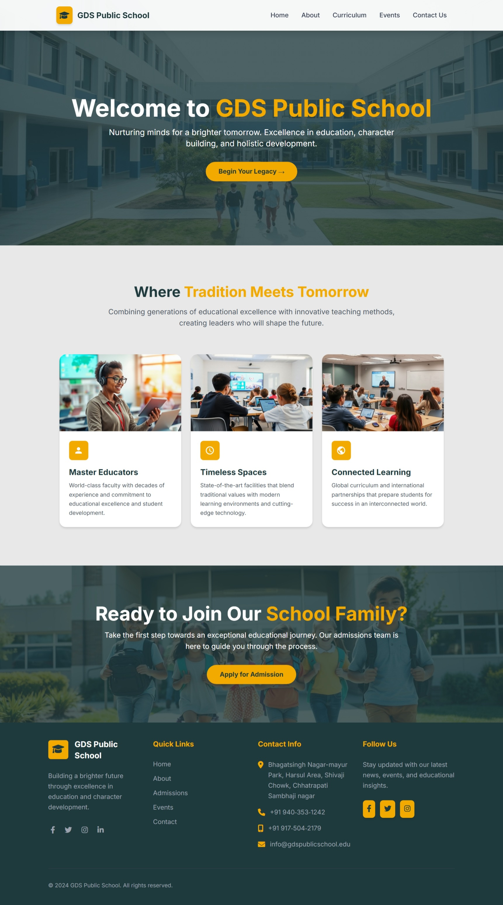

<div align="center">

# 🎓 GDS Public School Website

</div>

---

A modern, responsive school website with integrated Google Sheets backend for dynamic event management and contact form submissions.

    

## 🧭 Overview

GDS Public School Website is a comprehensive educational platform featuring dynamic event management, contact forms, and curriculum information. The project integrates seamlessly with Google Sheets for real-time data management without requiring a traditional database.

## ✨ Features

### 🎯 Core Features
- **Responsive Design** - Mobile-first approach with Tailwind CSS
- **Dynamic Event Management** - Real-time event fetching and filtering
- **Event Registration System** - Complete registration workflow with Google Sheets integration
- **Contact Form** - Direct submissions to Google Sheets
- **Featured Events** - Highlighted events with calendar integration
- **Mobile Navigation** - Smooth hamburger menu with animations

### 📊 Event Management
- Category-based filtering (Seminars, Workshops, Bootcamps, etc.)
- Time-based filtering (Upcoming/Past events)
- Event registration with form validation
- Google Calendar integration
- Featured event showcase

### 📱 User Experience
- Fully responsive across all devices
- Loading states and error handling
- Smooth animations and transitions
- Accessibility-compliant design

## 🧩 Tech Stack

| Technology | Purpose |
|------------|---------|
| **HTML5** | Structure and semantic markup |
| **Tailwind CSS** | Utility-first styling framework |
| **JavaScript (ES6+)** | Dynamic functionality and API integration |
| **Google Apps Script** | Backend API for data operations |
| **Google Sheets** | Database for events and registrations |
| **Font Awesome** | Icon library |
| **Inter Font** | Typography |

## 🏗️ Project Structure

```
gds-school-website/
├── img/                          # Image assets
│   ├── about/                    # About page images
│   ├── curriculum/               # Curriculum page images
│   └── event/                    # Event page images
├── index.html                    # Homepage
├── About.html                    # About page
├── Curriculum.html               # Curriculum information
├── Event.html                    # Events page with Google Sheets integration
├── Contact_Us.html               # Contact form page
└── README.md                     # Project documentation
```

## 🔗 Google Sheets Integration

### Data Flow Architecture


### 📋 Events Data Sheet Structure
| Column | Description | Example |
|--------|-------------|---------|
| `id` | Unique identifier | 1, 2, 3... |
| `title` | Event name | "Science Fair 2024" |
| `date` | Event date | "2024-03-15" |
| `time` | Event time | "2:00 PM" |
| `location` | Venue | "Main Auditorium" |
| `category` | Event type | "Workshop", "Seminar" |
| `type` | Format | "Online", "Offline" |
| `description` | Event details | "Annual science exhibition..." |
| `image` | Image URL | "https://..." |
| `featured` | Featured flag | "Yes", "No" |
| `coordinator` | Event coordinator | "Dr. Smith" |
| `email` | Contact email | "coordinator@school.com" |

### 📝 Registration Data Sheet Structure
| Column | Description |
|--------|-------------|
| `eventTitle` | Registered event |
| `eventDate` | Event date |
| `eventTime` | Event time |
| `eventLocation` | Event venue |
| `fullName` | Registrant name |
| `email` | Contact email |
| `phone` | Phone number |
| `relationship` | Relationship to school |
| `notes` | Special requirements |
| `registrationDate` | Submission timestamp |

## ⚙️ Setup Instructions

### 1. Google Sheets Setup

#### Create Events Sheet
1. Create a new Google Sheet for events data
2. Add column headers as specified in the data structure above
3. Populate with your event data

#### Create Registration Sheet
1. Create another Google Sheet for registrations
2. Add column headers for registration data
3. This will auto-populate when users register

### 2. Google Apps Script Configuration

#### Events Data Script
```javascript
function doGet(e) {
  const sheet = SpreadsheetApp.getActiveSheet();
  const data = sheet.getDataRange().getValues();
  const headers = data[0];
  const rows = data.slice(1);
  
  const events = rows.map(row => {
    const event = {};
    headers.forEach((header, index) => {
      event[header] = row[index];
    });
    return event;
  });
  
  return ContentService
    .createTextOutput(JSON.stringify(events))
    .setMimeType(ContentService.MimeType.JSON);
}
```

#### Registration Script
```javascript
function doPost(e) {
  const sheet = SpreadsheetApp.getActiveSheet();
  const data = [
    e.parameter.eventTitle,
    e.parameter.eventDate,
    e.parameter.eventTime,
    e.parameter.eventLocation,
    e.parameter.fullName,
    e.parameter.email,
    e.parameter.phone,
    e.parameter.relationship,
    e.parameter.notes,
    e.parameter.registrationDate
  ];
  sheet.appendRow(data);
  return ContentService.createTextOutput('Success');
}
```

### 3. Deploy Apps Scripts
1. Save both scripts in Google Apps Script
2. Deploy as web apps with access set to "Anyone"
3. Copy the deployment URLs

### 4. Update Frontend Configuration
In `Event.html`, update the URLs:
```javascript
const GOOGLE_SCRIPT_URL = 'YOUR_EVENTS_SCRIPT_URL';
const REGISTRATIONSCRIPTURL = 'YOUR_REGISTRATION_SCRIPT_URL';
```

### 5. Local Development
1. Clone or download the project files
2. Open `index.html` in a web browser
3. For local server: `python -m http.server 8000` or use Live Server extension

## 🚀 How It Works

### Event Loading Process
1. **Page Load** → JavaScript fetches events from Google Sheets
2. **Data Processing** → Events are categorized and filtered
3. **UI Rendering** → Events displayed with filtering options
4. **Featured Event** → First featured event shown in hero section

### Registration Workflow
1. **User Clicks Register** → Modal opens with event details
2. **Form Submission** → Data validated and sent to Google Sheets
3. **Confirmation** → Success message displayed
4. **Data Storage** → Registration stored in Google Sheets

### Filtering System
- **Category Filters**: All Events, Seminars, Workshops, Bootcamps, Entertainment, Meetings
- **Time Filters**: Upcoming Events, Past Events
- **Real-time Updates**: Instant filtering without page reload

## 📸 Screenshots

### Homepage


### Events Page


### Registration Modal


## 🔧 Customization

### Adding New Event Categories
1. Update the `categories` array in `Event.html`
2. Add corresponding data in Google Sheets
3. Update category colors in `getCategoryColor()` function

### Styling Modifications
- Colors: Update Tailwind config in `<script>` section
- Fonts: Modify Google Fonts import in `<head>`
- Layout: Adjust Tailwind classes in HTML

### Adding New Pages
1. Create new HTML file following existing structure
2. Update navigation links in all pages
3. Add mobile navigation entry

## 🤝 Contributing

1. Fork the repository
2. Create a feature branch (`git checkout -b feature/new-feature`)
3. Commit changes (`git commit -am 'Add new feature'`)
4. Push to branch (`git push origin feature/new-feature`)
5. Create Pull Request

## 📄 License

This project is licensed under the MIT License - see the [LICENSE](LICENSE) file for details.

## 📞 Support

For support and questions:
- **Email**: info@gdspublicschool.edu
- **Phone**: +91 940-353-1242
- **Address**: Bhagatsingh Nagar-mayur Park, Harsul Area, Shivaji Chowk, Chhatrapati Sambhaji nagar

---

**Built with ❤️ for GDS Public School**